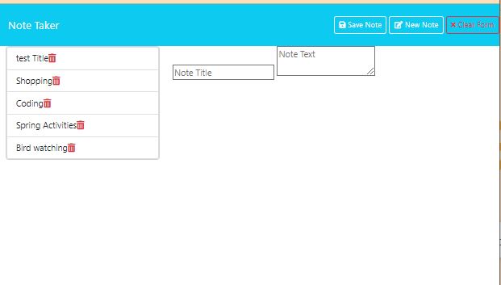

# Note-Taker

## Descriptiom
This application feature a Note Taker app, use to write and save notes. This application uses Express.js in the back end and save and retrieve notes from a JSON file.

## Table of Contents
- [Description](#Description)
- [User-Story&Acceptance-Criteria](#User-Story-&-Acceptance-Criteria)
- [Webpage-Preview](#Webpage-Preview)
- [Usage](#Usage)
- [Skill-Improved](#Skill-Improved)
- [Technologies](#Technologies)
- [Author](#Author)
- [License](#license)
- [Credits](#credits)

## User Story & Acceptance Criteria

### User Story
`AS A small business owner
I WANT to be able to write and save notes
SO THAT I can organize my thoughts and keep track of tasks I need to complete`

### Acceptance Criteria
`GIVEN a note-taking application
WHEN I open the Note Taker
THEN I am presented with a landing page with a link to a notes page
WHEN I click on the link to the notes page
THEN I am presented with a page with existing notes listed in the left-hand column, plus empty fields to enter a new note title and the note’s text in the right-hand column
WHEN I enter a new note title and the note’s text
THEN a "Save Note" button and a "Clear Form" button appear in the navigation at the top of the page
WHEN I click on the Save button
THEN the new note I have entered is saved and appears in the left-hand column with the other existing notes and the buttons in the navigation disappear
WHEN I click on an existing note in the list in the left-hand column
THEN that note appears in the right-hand column and a "New Note" button appears in the navigation
WHEN I click on the "New Note" button in the navigation at the top of the page
THEN I am presented with empty fields to enter a new note title and the note’s text in the right-hand column and the button disappears `

## Webpage Preview

## Usage
The link for the webpage is:https://clcoder2425.github.io/Note-Taker/

## Skills Improved

- HTML 
- JavaScript
- CSS
- Express.js
- API routes
- Storing data with JSON

## Technologies
- HTML 
- JavaScript
- CSS
- Dotenv
- Nodemon
- UUID

## Author
 Carmen Jimenez : 
 
 ## License
  

## Credits
- How to use dotenv: https://www.dotenv.org/blog/2023/03/13/how-to-use-dotenv.html
- Express documentation: https://developer.mozilla.org/en-US/docs/Learn/Server-side/Express_Nodejs/